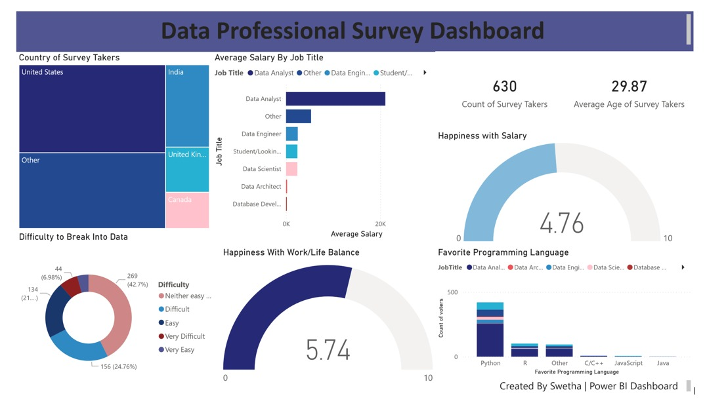

Data Professional Survey Dashboard – Power BI Project

📊 Project Overview
This project presents an interactive Power BI dashboard based on a Data Professionals Survey. It highlights industry trends including salary ranges, job roles, work-life satisfaction, popular programming languages, and geographical distribution of survey respondents.

🎯 Objective
To analyze current data industry insights and help users understand:

Most common job roles in the data field

Salary comparison by role

Work satisfaction factors

Geographic spread of data professionals

Preferred programming languages in the community

🛠 Tools Used

Microsoft Power BI

DAX Calculations

Data Modeling

Data Cleaning & Transformation (Power Query)

Interactive Visualizations

📌 Key Insights

Majority of survey respondents are Data Analysts

Python is the most preferred programming language

Work-life balance satisfaction (Avg: 5.74/10) is slightly higher than salary satisfaction (Avg: 4.76/10)

Entering the data field is rated as somewhat challenging by most participants

📁 Files Included

PowerBI_Dashboard.pbix — Interactive dashboard

Dashboard.png — Preview image

Dataset.xlsx — Source data for the survey

## 🖥️ **Dashboard Preview**

🖥 Dashboard Features
✔ Role-wise salary comparison
✔ Age & respondent count metrics
✔ Country-wise participation (Tree Map)
✔ Happiness with salary & work-life balance (Gauge charts)
✔ Difficulty to enter data field (Donut chart)
✔ Programming language popularity (Stacked bar chart)

## 📫 **Connect With Me**

👉 **LinkedIn:** [tiramdas-swetha2231](https://www.linkedin.com/in/tiramdas-swetha2231/)
